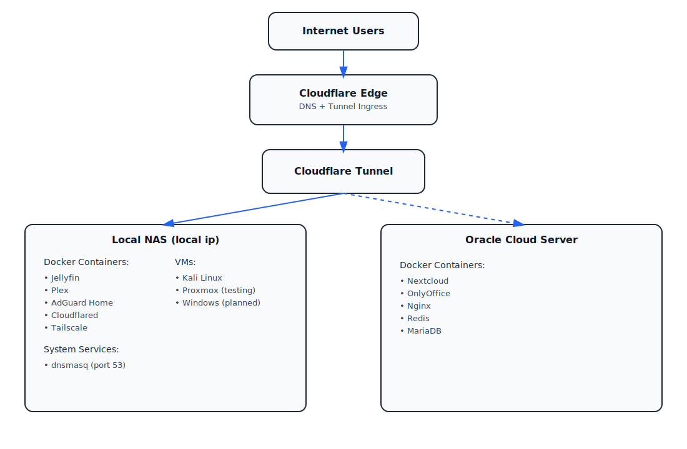

# RemoteVault Ultimate Release

**All-in-One Cloud + NAS + Media + VPN + VM Full-Stack Environment**

This repository contains the fully integrated RemoteVault stack, including cloud server backend, NAS, media servers, VPN integration, and VM initialization. Designed for seamless deployment and secure external access via Cloudflare Tunnel.

---

## **Stack Overview**

- **Media Servers**:
  - Jellyfin (custom container)
  - Plex (testing container)
- **Cloud Collaboration**:
  - Nextcloud
  - OnlyOffice integration
  - GNIX
- **Networking & Security**:
  - Cloudflare Tunnel for secure external access
  - Tailscale VPN for private network access
  - AdGuard DNS for centralized network resolution
- **VM Infrastructure**:
  - Kali Linux (for testing/security)
  - Proxmox
  - Windows VM (planned)
- **Local NAS Integration**:
  - Synology/UGreen NAS directories mounted in containers
- **Monitoring & Metrics**:
  - Cloudflared metrics server
  - Logs for troubleshooting ingress and tunnel connections

---

## **Architecture Diagram**

- Cloudflare Tunnel handles inbound traffic and securely routes to internal services.
- Containers are primarily run in **bridge mode**, with specific ports mapped for each service.
- Tailscale VPN provides secure administrative access without affecting media server performance significantly.

---

## Core Technologies

### Control Plane
- **Cloudflare Tunnel** — Zero-trust public ingress (no open ports)
- **Tailscale** — Identity-based private access
- **AdGuard Home** — VPN-scoped DNS filtering (Split DNS)

### Local NAS (On-Prem)
- Jellyfin
- Plex
- AdGuard Home
- Cloudflared
- Tailscale
- Virtual Machines (Kali, Proxmox testing)

### Cloud (Oracle)
- Nextcloud
- OnlyOffice
- Nginx
- Redis
- MariaDB

---

## Key Engineering Lessons

- Control planes must not overlap
- Silent failures are the most dangerous
- DNS ownership matters
- Simpler configs outperform clever ones
- Documentation is a reliability feature

---

## Security Model

- No inbound ports exposed
- Public access via Cloudflare Tunnel only
- Private admin access via VPN
- Split DNS to isolate trust boundaries

---

## Roadmap

- SearxNG (private search engine)
- Ollama (local LLM inference)
- Expanded monitoring and alerting
- VM-based security testing

---

## Why This Project Matters

This repository reflects real-world infrastructure tradeoffs:
debugging ambiguity, minimizing blast radius, and designing for maintainability — not demos.

---

