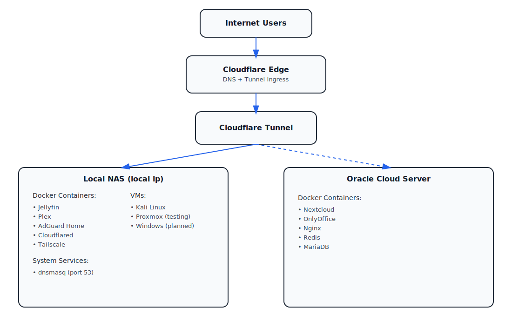

# RemoteVault — Hybrid Cloud Infrastructure P1

**All-in-One Cloud + NAS + Media + VPN + VM Full-Stack Environment**

Self-hosted infrastructure stack spanning a local NAS and an Oracle cloud instance. Designed for zero exposed ports, secure external access via Cloudflare Tunnel, and private admin access via Tailscale VPN.

---

## Architecture

See [`ARCHITECTURE/architecture-overview.md`](./ARCHITECTURE/architecture-overview.md) for the full written breakdown.

- Cloudflare Tunnel handles all inbound traffic — no open ports on any host
- Containers run in bridge mode with per-service port mapping
- Tailscale provides secure admin access without impacting media server performance
- Split DNS isolates trust boundaries between public and private access paths

---

## Stack Overview

### Local NAS Stack [`docker/NAS Stack/`](./docker/NAS%20Stack/)

| Service | Purpose |
|---|---|
| **Jellyfin** | Self-hosted media server (custom container) |
| **Plex** | Secondary media server (testing) |
| **AdGuard Home** | VPN-scoped DNS filtering, split DNS |
| **Cloudflared** | Cloudflare Tunnel daemon |
| **Tailscale** | Identity-based private VPN mesh |
| **SearXNG** | Private self-hosted metasearch engine |
| **Ollama** | Local LLM inference |

Full compose definition: [`nas_stack.yml`](./docker/NAS%20Stack/nas_stack.yml)

### Cloud Stack — Oracle [`docker/Cloud Stack/`](./docker/Cloud%20Stack/)

| Service | Purpose |
|---|---|
| **Nextcloud** | Cloud collaboration and file sync |
| **OnlyOffice** | Document editing integrated with Nextcloud |
| **GNIX / Nginx** | Reverse proxy + SSL termination |
| **Redis** | Session caching for Nextcloud |
| **MariaDB** | Database backend |

Full compose definition: [`cloud_stack.yml`](./docker/Cloud%20Stack/cloud_stack.yml)

### VM Infrastructure

| VM | Purpose |
|---|---|
| **Kali Linux** | Security testing and penetration testing |
| **Proxmox** | Hypervisor for VM management |
| **Windows VM** | Planned — compatibility testing |

---

## Networking

### Control Plane

| Layer | Technology | Role |
|---|---|---|
| Public ingress | Cloudflare Tunnel | Zero-trust, no exposed ports |
| Private admin | Tailscale | Identity-based VPN mesh |
| DNS | AdGuard Home | Split DNS, VPN-scoped filtering |

See [`networking/vpn-vs-tunnel.md`](./networking/vpn-vs-tunnel.md) for the full design decision: when to use Tailscale vs Cloudflare Tunnel and why the control planes must not overlap.

---

## Security Model

- **No inbound ports exposed** — public access via Cloudflare Tunnel only
- **Private admin access** via Tailscale (separate trust boundary)
- **Split DNS** to isolate internal and external resolution
- **Containers isolated** via Docker bridge networks per stack

NIST CSF alignment:

| Function | Implementation |
|---|---|
| Identify | Asset inventory via Docker labels and compose file naming |
| Protect | Zero open ports, Tailscale identity auth, AdGuard DNS |
| Detect | Cloudflared metrics server, container log pipeline |
| Respond | Tunnel-level traffic blocking, VPN revocation |
| Recover | Compose-based redeployment, NAS-backed volume mounts |

---

## Key Engineering Lessons

From [`POSTMORTEM.md`](./POSTMORTEM.md) and [`CHANGELOG.md`](./CHANGELOG.md):

- **Control planes must not overlap** — Tailscale and Cloudflare Tunnel serve different purposes; mixing them caused silent routing failures
- **Silent failures are the most dangerous** — DNS misconfigurations failed without errors, making debugging non-obvious
- **DNS ownership matters** — split DNS requires strict discipline about which resolver handles which domain
- **Simpler configs outperform clever ones** — reducing compose complexity eliminated an entire class of startup-order bugs
- **Documentation is a reliability feature** — the postmortem and architecture docs paid dividends during debugging

---

## Documentation

| Doc | Description |
|---|---|
| [`ARCHITECTURE/architecture-overview.md`](./ARCHITECTURE/architecture-overview.md) | Full system design with component relationships |
| [`ARCHITECTURE/architecture.svg`](./ARCHITECTURE/architecture.svg) | Visual architecture diagram |
| [`networking/vpn-vs-tunnel.md`](./networking/vpn-vs-tunnel.md) | VPN vs tunnel design decision |
| [`docker/NAS Stack/router.md`](./docker/NAS%20Stack/router.md) | Router and network config notes |
| [`docker/NAS Stack/tailscale/tailscale.md`](./docker/NAS%20Stack/tailscale/tailscale.md) | Tailscale setup and config |
| [`docker/Cloud Stack/push.md`](./docker/Cloud%20Stack/push.md) | Cloud stack deployment workflow |
| [`CHANGELOG.md`](./CHANGELOG.md) | Versioned infrastructure change log |
| [`POSTMORTEM.md`](./POSTMORTEM.md) | Incident analysis — root causes, resolutions, prevention |

---

## Phase 2 Roadmap 🔄

| Feature | Status |
|---|---|
| Expanded monitoring and alerting (Loki + Grafana) | Planned |
| Automated ZFS snapshot rotation | Planned |
| Off-site encrypted backup (restic) | Planned |
| VM-based security testing pipeline | Planned |
| Ansible playbooks for full reproducibility | Planned |

---

## Why This Project Matters

This stack reflects real-world infrastructure tradeoffs: debugging ambiguity without vendor support, minimizing blast radius during failures, and designing for maintainability over demos. Every architectural decision here was made under real constraints and documented for reproducibility.
